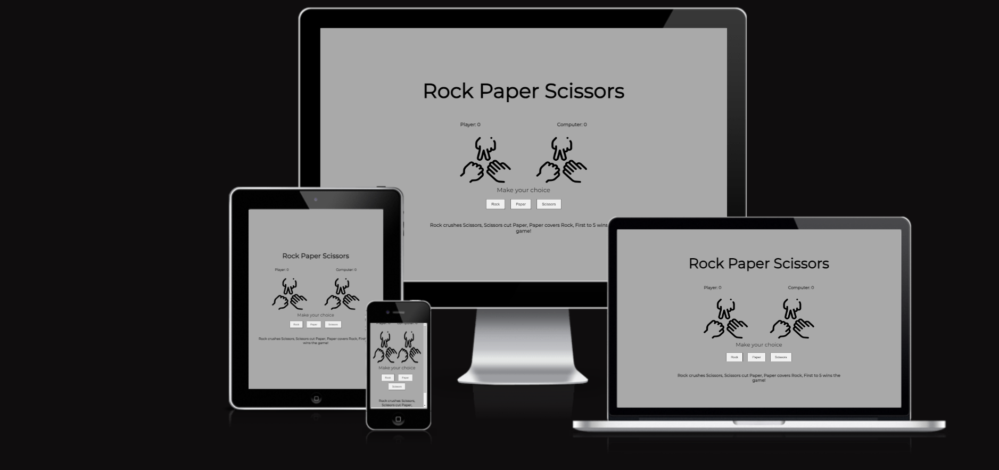
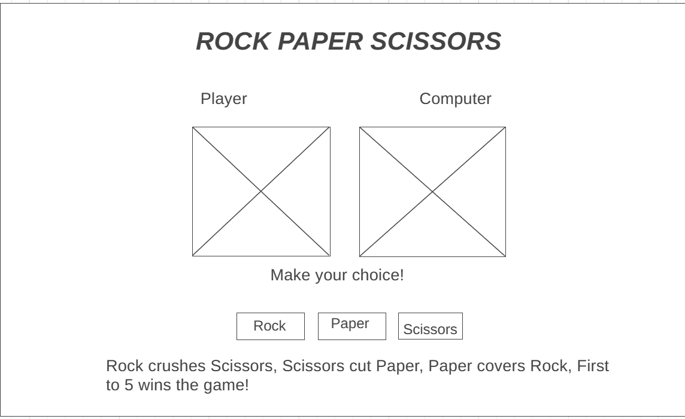
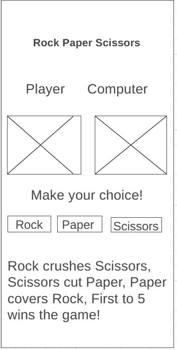
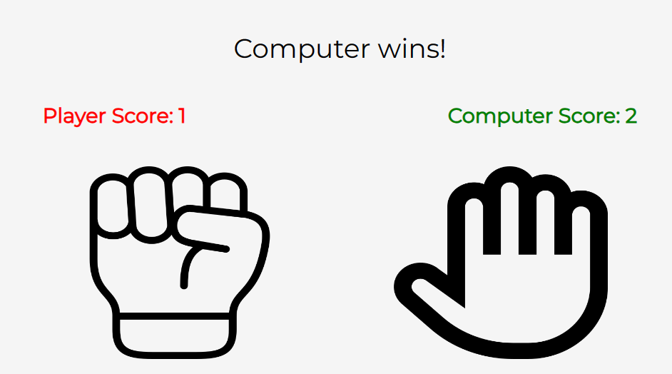
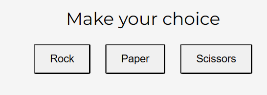
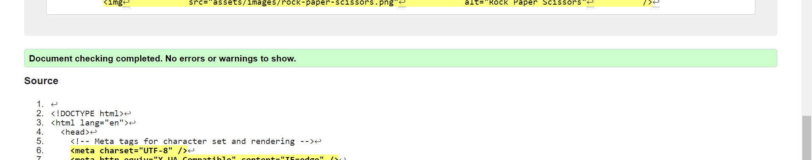
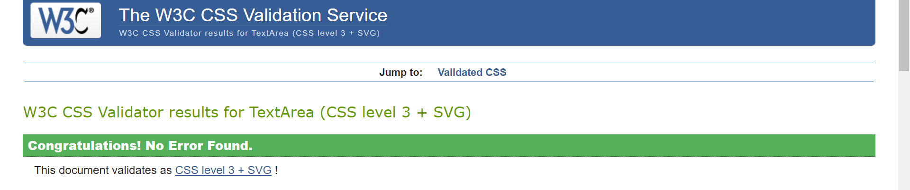
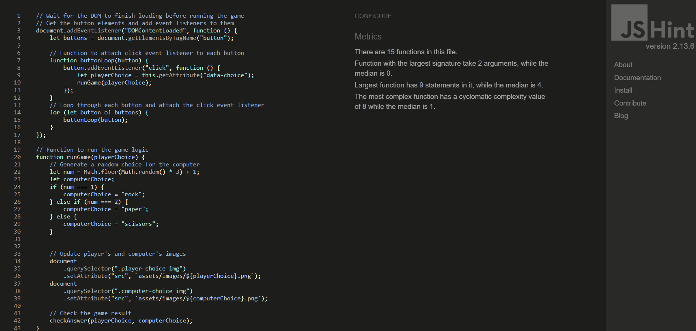
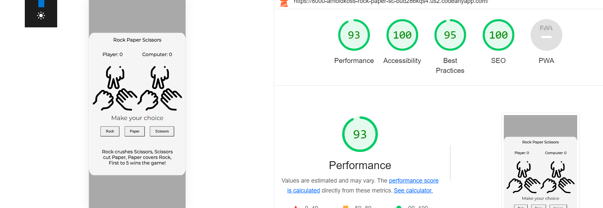
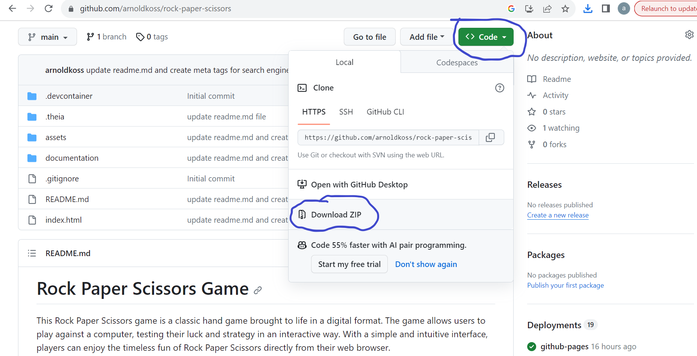

# Rock Paper Scissors Game

This Rock Paper Scissors game is a classic hand game brought to life in a digital format. The game allows users to play against a computer, testing their luck and strategy in an interactive way. With a simple and intuitive interface, players can enjoy the timeless fun of Rock Paper Scissors directly from their web browser.

## Contents
- [Rock Paper Scissors Game](#rock-paper-scissors-game)
- [Contents](#contents)
- [User Storyes](#user-storyes)
- [Design](#design)
- [Wireframes](#wireframes)
- [Features](#features)
- [Future Features](#future-features)
- [Technologies Used](#technologies-used)
- [Frameworks, Libraries \& Programs Used](#frameworks-libraries--programs-used)
- [Testing](#testing)
- [Further Testing](#further-testing)
- [Manual Testing](#manual-testing)
- [Deployment](#deployment)
- [Local Deployment](#local-deployment)
- [Credits](#credits)
- [Acknowledgments](#acknowledgments)

## User Storyes

- **As a Player:** I want to easily understand how to play the game and what each option (rock, paper, scissors) represents so that I can make informed choices during gameplay.
- **As a User:** I want the game interface to be intuitive and visually appealing, providing a seamless gaming experience without any confusion or distractions.
- **As a Competitor:** I want to compete against the computer in a fair and engaging game, with clear feedback on the results of each round, allowing me to track my progress and performance.
- **As a Player:** I want the game to be responsive and accessible across different devices and screen sizes, enabling me to enjoy the game on various platforms, including desktop and mobile.

## Design

- Colour Scheme

The color scheme of this project is designed to provide a visually appealing and user-friendly experience. The main components of the color scheme include:

**Body Background:** Dark Gray is used for the background of the main content, providing a subtle and elegant contrast that is easy on the eyes.

**Game Interface:** White is utilized for the game interface, ensuring a clean and minimalistic design that highlights the game elements effectively.

**Text:** Black is employed for the text, ensuring optimal readability and clarity against the white background, creating a seamless and user-friendly experience.

The combination of these colors creates a balanced and visually engaging environment that enhances the overall usability and aesthetics of the project.

- Typography

For this project the font used is [Montserrat](https://fonts.google.com/specimen/Montserrat).
This font provides great readability and a clean aesthetic.

- Imagery

The images used in this project were sourced from [Flaticon](https://www.flaticon.com/). Using icons rather than cropped pictures enhances the visual appeal and cohesiveness of the overall design, ensuring a consistent and polished aesthetic.

## Wireframes

- Desktop landing

  

- Mobile landing

  

## Features

- Responsive on all device sizes
- Accesible
- Real-Time Score Tracking
  -  Keep track of your progress with the real-time score tracking feature. 
- Clear Game Results
  - Receive instant feedback with clear and concise game results. Know whether you've won, lost, or tied with the computer at the end of each round, keeping the excitement alive throughout the game.
    

- User-Friendly Interface with Intuitive Buttons
  -  The game features a user-friendly interface with intuitive buttons for selecting your moves. Simply click on the 'Rock', 'Paper', or 'Scissors' button to make your choice.
   

## Future Features

-  As for future features i would like to add are the following:
   -  Add sound for when a game is ran.
   - A popup instructions modal. 

## Technologies Used

- [HTML5](https://en.wikipedia.org/wiki/HTML5)
- [CSS](https://en.wikipedia.org/wiki/CSS)
- [JavaScript](https://en.wikipedia.org/wiki/JavaScript)

## Frameworks, Libraries & Programs Used

- Google Fonts
  - Google Fonts was used to import the 'Montserrat', font into the style.css file which is used throughout the project.
- GitHub
  - GitHub is used to store the projects code.
- Wireframe.cc
  - Wireframe.cc was used to create the wireframes.
- Flaticon
  - Flaticon was used to download the icons used in the game as the rock, paper and scissors

## Testing

I used the W3C Markup Validator, W3C CSS Validator and the JSHint to ensure there where no syntax errors in my code.

I Used Lighthouse to check my app's speed, best practices and accessibility

## Further Testing

- The app was tested on Google Chrome, Mozilla Firefox and Safari browsers.
- The app was viewed on a variety of devices such as LENOVO THINKPAD T480S, Huawei P30 Pro and iPhone 15 Pro.
- Familly members and friends reviewed the app to point out bugs and get a feedback for user experience.

## Manual Testing

| Test Description                  | Description                                           | Expected Result                                                                     | Actual Result                                                                       | Pass/Fail |
| --------------------------------- | ----------------------------------------------------- | ----------------------------------------------------------------------------------- | ----------------------------------------------------------------------------------- | --------- |
| User selects rock                 | User selects 'rock' as their choice.                  | 'Rock' is registered as the user's choice.                                          | 'Rock' is registered as the user's choice.                                          | Pass      |
| User selects paper                | User selects 'paper' as their choice.                 | 'Paper' is registered as the user's choice.                                         | 'Paper' is registered as the user's choice.                                         | Pass      |
| User selects scissors             | User selects 'scissors' as their choice.              | 'Scissors' is registered as the user's choice.                                      | 'Scissors' is registered as the user's choice.                                      | Pass      |
| Determine Winner - Player wins    | Game determines that 'rock' beats 'scissors'.         | 'Player wins!' message is displayed.                                                | 'Player wins!' message is displayed.                                                | Pass      |
| Determine Winner - Computer wins  | Game determines that 'scissors' beats 'paper'.        | 'Computer wins' message is displayed.                                               | 'Computer wins' message is displayed.                                               | Pass      |
| Determine Tie                     | User and computer select the same option.             | 'It's a tie' message is displayed.                                                  | 'It's a tie' message is displayed.                                                  | Pass      |
| Winning Condition - Player wins   | User reaches a score of 5 points before the computer. | 'Player wins the game!' message is displayed.                                       | 'Player wins the game!' message is displayed.                                       | Pass      |
| Winning Condition - Computer wins | Computer reaches a score of 5 points before the user. | 'Computer wins the game!' message is displayed.                                     | 'Computer wins the game!' message is displayed.                                     | Pass      |
| Score Display - Player leads      | Player's score is higher than the computer's score.   | Player's score is displayed in green, and the computer's score is displayed in red. | Player's score is displayed in green, and the computer's score is displayed in red. | Pass      |
| Score Display - Computer leads    | Computer's score is higher than the player's score.   | Computer's score is displayed in green, and the player's score is displayed in red. | Computer's score is displayed in green, and the player's score is displayed in red. | Pass      |

## Deployment

The live link can be found here - <https://arnoldkoss.github.io/rock-paper-scissors/>

- The site was deployed to GitHub pages. The steps to deploy are as follows:
  - In the GitHub repository, navigate to the Settings tab.
  - From the source section drop-down menu, select the Master Branch.
  - Once the master branch has been selected, the page will be automatically refreshed with a detailed ribbon display to indicate the successful deployment.

## Local Deployment

- I deployed the site locally by downloading the .zip file from Github to my device.
- I unzipped the file and tested each link page to make sure it opened correctly on my browser.

## Credits

- Code used
  - Drawing inspiration from browsing the internet, I discovered an effective method for implementing a timer within the display result function.
- Content 
  - The icons in the game were taken from Flaticon.

## Acknowledgments    

I want to thank my mentors Rory and Luke for his great guidance and support and to the slack colleagues for the help I got.