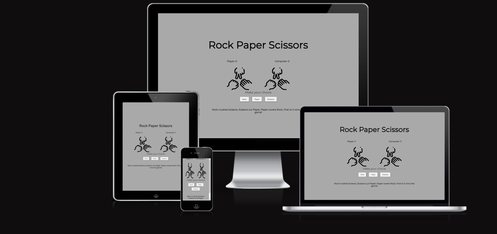

# Rock Paper Scissors Game

This Rock Paper Scissors game is a classic hand game brought to life in a digital format. The game allows users to play against a computer, testing their luck and strategy in an interactive way. With a simple and intuitive interface, players can enjoy the timeless fun of Rock Paper Scissors directly from their web browser.

## User Storyes

 - **As a Player:** I want to easily understand how to play the game and what each option (rock, paper, scissors) represents so that I can make informed choices during gameplay.
 - **As a User:** I want the game interface to be intuitive and visually appealing, providing a seamless gaming experience without any confusion or distractions.
 -  **As a Competitor:** I want to compete against the computer in a fair and engaging game, with clear feedback on the results of each round, allowing me to track my progress and performance.
- **As a Player:** I want the game to be responsive and accessible across different devices and screen sizes, enabling me to enjoy the game on various platforms, including desktop and mobile.

## Design

- Colour Scheme
  
 The game interface is designed using a harmonious blend of colors, with a dark gray background providing a sleek and modern backdrop. Crisp black text ensures clear and easy-to-read instructions and game updates. Additionally, green highlights signify the leading score, while red accents draw attention to the score that is lagging, creating a visually engaging and dynamic gaming experience.

- Typography

For this project the font used is [Montserrat](https://fonts.google.com/specimen/Montserrat).
This font provides great readability and a clean aesthetic.

- Imagery
  
  The images used in this project were sourced from [Flaticon](https://www.flaticon.com/). Using icons rather than cropped pictures enhances the visual appeal and cohesiveness of the overall design, ensuring a consistent and polished aesthetic.
